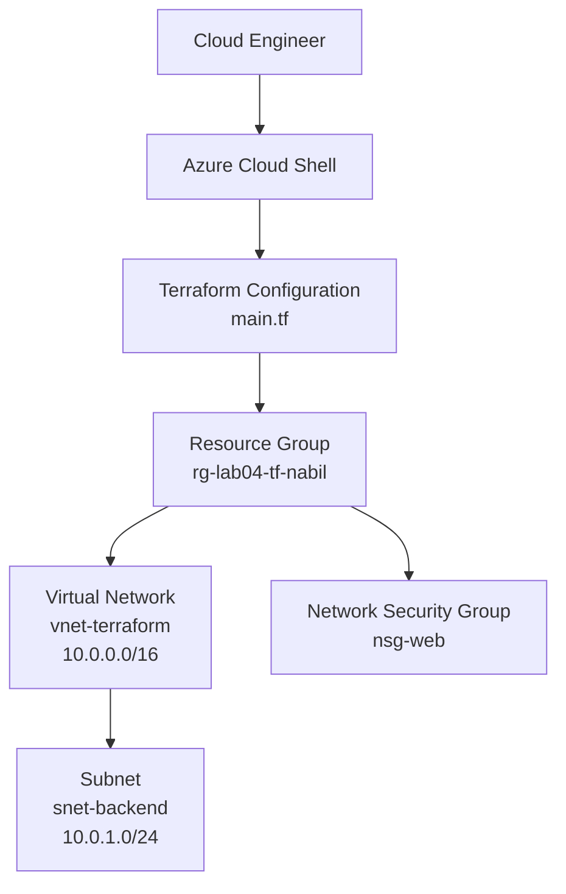

# Lab 04: Infrastructure as Code with Terraform

## Overview

In this lab, I used **Terraform** in **Azure Cloud Shell** to deploy and manage Azure infrastructure through code instead of manually creating resources in the Azure portal.

I first deployed a Resource Group, Virtual Network, and Subnet. I then updated the existing Terraform configuration to add a Network Security Group without rebuilding the resources that were already running. This demonstrated how Terraform compares the desired configuration against its state file and changes only what is necessary.

---

## Project Objectives

- Understand the purpose of Infrastructure as Code.
- Write a Terraform configuration using HashiCorp Configuration Language.
- Deploy Azure resources with `terraform init`, `terraform plan`, and `terraform apply`.
- Use Terraform dependencies to control resource creation order.
- Add a new resource to an existing environment.
- Understand how the Terraform state file tracks deployed infrastructure.
- Remove Terraform-managed resources with `terraform destroy`.

---

## Architecture



> **Note:** The lab creates the Network Security Group as a separate Azure resource. It is not associated with the subnet in the provided configuration.

---

## Azure Resources Deployed

| Resource | Name | Configuration |
|---|---|---|
| Resource Group | `rg-lab04-tf-nabil` | East US |
| Virtual Network | `vnet-terraform` | `10.0.0.0/16` |
| Subnet | `snet-backend` | `10.0.1.0/24` |
| Network Security Group | `nsg-web` | Empty NSG created for the update demonstration |

---

## Technologies Used

- Microsoft Azure
- Azure Cloud Shell
- Terraform
- AzureRM Provider
- HashiCorp Configuration Language
- Azure Virtual Network
- Azure Network Security Group

---

## Terraform Workflow

| Command | Purpose |
|---|---|
| `terraform init` | Initializes the project and downloads the AzureRM provider. |
| `terraform plan` | Previews the changes Terraform intends to make. |
| `terraform apply` | Creates or updates the Azure resources. |
| `terraform destroy` | Removes all resources tracked in the Terraform state file. |

The workflow used throughout the lab was:

```text
terraform init → terraform plan → terraform apply
```

---

## Implementation

### 1. Open Azure Cloud Shell

I opened Azure Cloud Shell from the Azure portal and selected **Bash**.

```bash
mkdir terraform-lab
cd terraform-lab
```

### 2. Create the Terraform Configuration

I created the main Terraform file using the Cloud Shell editor.

```bash
code main.tf
```

### 3. Define the Azure Resources

```hcl
terraform {
  required_providers {
    azurerm = {
      source  = "hashicorp/azurerm"
      version = "~> 3.0"
    }
  }
}

provider "azurerm" {
  features {}
}

resource "azurerm_resource_group" "rg" {
  name     = "rg-lab04-tf-nabil"
  location = "East US"
}

resource "azurerm_virtual_network" "vnet" {
  name                = "vnet-terraform"
  location            = azurerm_resource_group.rg.location
  resource_group_name = azurerm_resource_group.rg.name
  address_space       = ["10.0.0.0/16"]
}

resource "azurerm_subnet" "subnet" {
  name                 = "snet-backend"
  resource_group_name  = azurerm_resource_group.rg.name
  virtual_network_name = azurerm_virtual_network.vnet.name
  address_prefixes     = ["10.0.1.0/24"]
}
```

Terraform automatically understood the dependencies because the Virtual Network referenced the Resource Group and the Subnet referenced the Virtual Network.

### 4. Initialize Terraform

```bash
terraform init
```

Expected result:

```text
Terraform has been successfully initialized!
```

### 5. Preview the Deployment

```bash
terraform plan
```

Expected initial plan:

```text
Plan: 3 to add, 0 to change, 0 to destroy.
```

### 6. Deploy the Infrastructure

```bash
terraform apply
```

After reviewing the plan, I entered `yes` to approve the deployment.

Expected result:

```text
Apply complete! Resources: 3 added, 0 changed, 0 destroyed.
```

### 7. Verify the Azure Resources

I verified the deployment in the Azure portal by confirming:

- The Resource Group was created in East US.
- The Virtual Network used the `10.0.0.0/16` address space.
- The Subnet used the `10.0.1.0/24` address range.

### 8. Add a Network Security Group

I updated `main.tf` by adding the following resource block:

```hcl
resource "azurerm_network_security_group" "nsg" {
  name                = "nsg-web"
  location            = azurerm_resource_group.rg.location
  resource_group_name = azurerm_resource_group.rg.name
}
```

I then previewed the update:

```bash
terraform plan
```

Expected result:

```text
Plan: 1 to add, 0 to change, 0 to destroy.
```

This confirmed that Terraform recognized the existing resources and planned to create only the new Network Security Group.

After applying the update:

```bash
terraform apply
```

Expected result:

```text
Apply complete! Resources: 1 added, 0 changed, 0 destroyed.
```

### 9. Remove the Lab Environment

```bash
terraform destroy
```

Expected result:

```text
Destroy complete! Resources: 4 destroyed.
```

Using `terraform destroy` kept the Azure environment synchronized with the Terraform state file.

---

## Understanding the Terraform State File

Terraform created a `terraform.tfstate` file after the first successful deployment. This file acts as Terraform's record of the resources it manages.

Terraform uses the state file to:

- Identify resources that already exist.
- Compare the deployed environment with `main.tf`.
- Determine which resources need to be created, updated, or removed.
- Avoid rebuilding unchanged resources.

The state file should not be manually edited, deleted, or committed to a public repository because it can contain sensitive infrastructure details.

---

## Recommended Repository Structure

```text
cloudlab-004/
├── README.md
├── main.tf
├── .gitignore
└── screenshots/
    ├── terraform-init.png
    ├── terraform-plan.png
    ├── terraform-apply.png
    ├── azure-resources.png
    └── terraform-update.png
```

Recommended `.gitignore` entries:

```gitignore
.terraform/
*.tfstate
*.tfstate.*
.terraform.lock.hcl
crash.log
```

---

## Suggested Screenshots

| Screenshot | What It Should Show |
|---|---|
| Terraform initialization | Successful `terraform init` output |
| Initial plan | `3 to add, 0 to change, 0 to destroy` |
| Initial deployment | Successful creation of three resources |
| Azure Resource Group | VNet and NSG visible in the resource group |
| Subnet configuration | `snet-backend` with `10.0.1.0/24` |
| Updated plan | `1 to add, 0 to change, 0 to destroy` |
| Final resource view | Resource Group, VNet, Subnet, and NSG confirmed |

---

## Key Takeaways

- Infrastructure as Code makes cloud deployments repeatable and easier to document.
- `terraform plan` provides a safety check before infrastructure changes are made.
- Terraform automatically determines resource creation order through references and dependencies.
- The Terraform state file allows Terraform to identify what already exists.
- Updating the configuration does not rebuild unchanged resources.
- Terraform can create, update, and remove an environment through a consistent command-based workflow.

---

## Skills Demonstrated

- Infrastructure as Code
- Terraform configuration
- Azure resource deployment
- Azure networking
- Resource dependency management
- Terraform state management
- Change planning and deployment validation
- Cloud environment cleanup

---

## Video Walkthrough

A Loom walkthrough can be added here after the lab demonstration is recorded.

```text
Loom Video: Add link here
```

---

## Author

**Nabil Ibrahim**

This project is part of my hands-on Azure cloud learning portfolio.
